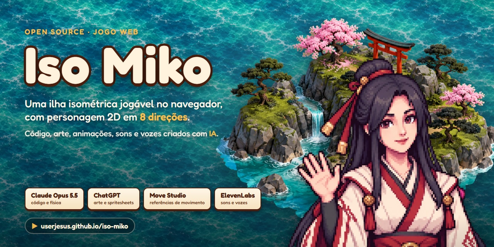
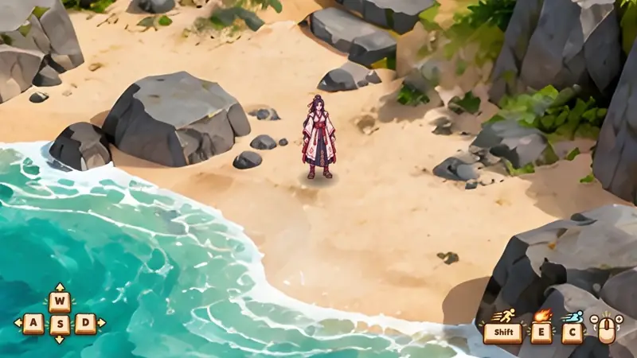
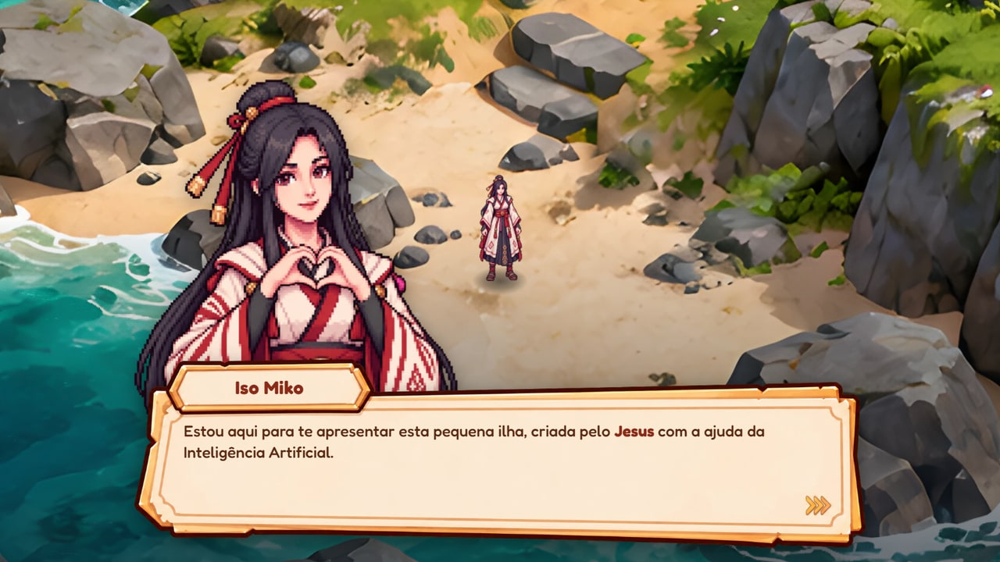
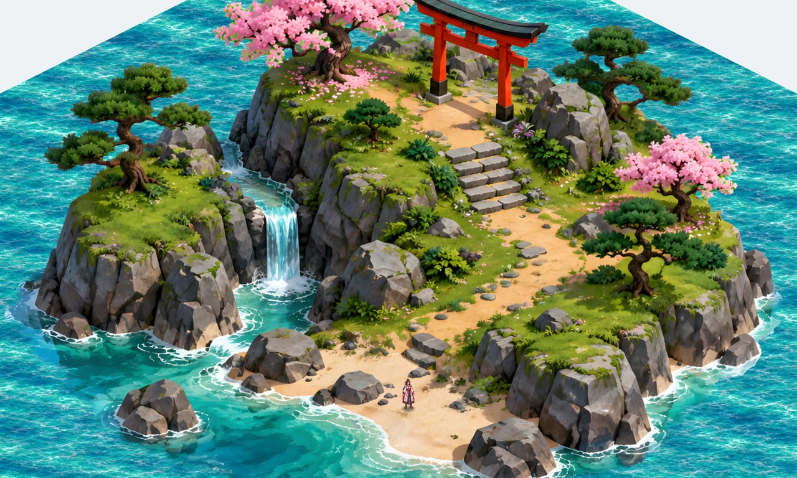

<p align="center">
  
</p>

<h1 align="center">Iso Miko</h1>

<p align="center">
  Uma ilha isométrica jogável no navegador, com personagem 2D em 8 direções.<br>
  Código, arte, animações, sons e vozes criados com Inteligência Artificial.
</p>

<p align="center">
  <a href="https://userjesus.github.io/iso-miko/"><b>▶ Jogar no navegador</b></a> ·
  <a href="#rodar-localmente">Rodar localmente</a> ·
  <a href="docs/TECNICO.md">Documentação técnica</a> ·
  <a href="https://www.linkedin.com/in/ojesus">LinkedIn do autor</a>
</p>

<p align="center">
  <a href="https://github.com/userJesus/iso-miko/actions/workflows/deploy.yml"></a>
  <a href="LICENSE"></a>
  
  
  
</p>

<p align="center">
  
</p>

## Sobre

Iso Miko é um projeto independente, feito para estudo, experimentação e aprendizado. A ideia foi testar até onde dá para chegar construindo um jogo pequeno, mas caprichado, com IA em todas as etapas: a ilha pintada, a personagem e as animações dela, os efeitos, os sons, as falas e o código.

O foco é a **movimentação natural de uma personagem 2D em 8 direções**: parar, andar, correr, deslizar e lançar bola de fogo. O cenário é uma **pintura isométrica transformada em mapa jogável**, com alturas, escadas, paredes e objetos que escondem a personagem quando ela passa por trás.

| | |
| --- | --- |
|  |  |
| **Apresentação inicial**: na primeira visita, a Iso Miko apresenta a ilha com voz e texto. | **A ilha**: praia, degraus de pedra, escadaria até o torii, cascata e mar animado. |

### Destaques

- **Animação dirigida pela distância**: a cadência do passo acompanha a velocidade e os pés não patinam. O giro passa pelas direções intermediárias em vez de estalar.
- **Pipeline de sprites**: as spritesheets geradas por IA chegam com escala variando, tremido e ciclos desalinhados. Ferramentas próprias em Node normalizam altura, alinham o tronco, detectam o ciclo do passo e montam os atlas.
- **Cenário a partir de uma pintura**: a ilha é ampliada com rede neural (Real-ESRGAN), recortada e classificada pixel a pixel (areia, grama, pedra, água). Cada pixel ganha profundidade, para a personagem sumir atrás de árvores, rochas e do torii.
- **Física**: colisão com deslize rente às paredes, degraus com altura contínua, deslize com impulso e atrito, bola de fogo que explode ao bater.
- **Som medido**: cada arquivo é medido ao carregar (sonoridade BS.1770) e equilibrado pelo alvo da mixagem. Os passos são fatiados do arquivo e tocados no instante em que o pé toca o chão.

Os detalhes de cada parte estão na [documentação técnica](docs/TECNICO.md).

## Jogar online

**https://userjesus.github.io/iso-miko/**

- Precisa de **computador**, com teclado e mouse. Em celular e tablet aparece um aviso explicando a limitação.
- Precisa de um navegador com WebGL. Foi desenvolvido e testado no Chrome.
- Na primeira visita, a apresentação aparece antes do jogo. Depois de concluída, ela não se repete. Para rever, abra com [`?apresentacao`](https://userjesus.github.io/iso-miko/?apresentacao) no fim do endereço.

## Controles

| Tecla | Ação |
| --- | --- |
| `W` `A` `S` `D` ou setas | andar (`W` sobe na tela) |
| `Shift` (segurar) | correr |
| `C` (correndo) | deslizar |
| `E` | bola de fogo |
| roda do mouse | zoom |
| `H` | esconder ou mostrar o HUD |
| `M` | ligar ou desligar o som |
| clique, `Espaço`, `Enter` ou `→` | avançar as falas da apresentação |

## Rodar localmente

Precisa do [Git](https://git-scm.com/) e do [Node.js](https://nodejs.org/) 24 (a versão usada no desenvolvimento; o deploy também usa a 24).

```bash
git clone https://github.com/userJesus/iso-miko.git
cd iso-miko
npm install
npm run dev
```

Abra **http://localhost:5180**. Com `npm run dev`, a tecla `'` (`` ` `` no teclado americano) mostra o painel de ajustes: velocidades, passada, som, câmera e um demo automático das 8 direções.

| Comando | O que faz |
| --- | --- |
| `npm run dev` | servidor de desenvolvimento, com recarga automática |
| `npm run build` | confere os tipos e gera a versão de produção em `dist/` |
| `npm run preview` | serve o `dist/` para testar a versão de produção |
| `npm run typecheck` | só a checagem de tipos |

### Regenerar os assets (opcional)

Os assets já processados estão versionados em `public/`, então o jogo roda sem estes passos. Eles só são necessários se você mudar a arte original em `assets-src/`:

| Comando | Gera |
| --- | --- |
| `npm run sprites` | atlas da personagem e dos efeitos (`public/sprites/`) |
| `npm run level` | cenário: ilha ampliada, profundidade e grade do chão (`public/level/`) |
| `npm run hud` | peças do HUD de comandos e o aviso para celular (`public/hud/`) |
| `npm run welcome` | retratos e caixa de diálogo da apresentação (`public/welcome/`) |

O `npm run level` usa o [Real-ESRGAN](https://github.com/xinntao/Real-ESRGAN/releases/tag/v0.2.5.0) para ampliar a pintura. O executável não vai no repositório: baixe a versão para Windows e extraia em `.tools/esrgan/`. Sem ele, o pipeline amplia com Lanczos e avisa. Todos aceitam `--debug` (ex.: `npm run sprites -- --debug`), que grava imagens de conferência em `.sprite-debug/`.

## Publicação no GitHub Pages

O jogo é publicado pelo workflow [`.github/workflows/deploy.yml`](.github/workflows/deploy.yml) a cada push na `main`: ele instala as dependências, roda `npm run build` e publica o `dist/`. O andamento fica na aba [Actions](https://github.com/userJesus/iso-miko/actions).

Para publicar um fork: em **Settings → Pages**, escolha **Source: GitHub Actions** e faça um push na `main`. O jogo fica em `https://<seu-usuário>.github.io/<nome-do-repositório>/`. Como o build usa caminhos relativos (`base: './'` no `vite.config.ts`), funciona com qualquer nome de repositório.

## Ferramentas usadas

| Ferramenta | Uso no projeto |
| --- | --- |
| **Claude Opus 5.5** (Anthropic) | Código: lógica de física e de movimento, renderização, pipelines de sprites, cenário e áudio, interface e documentação. |
| **ChatGPT** (OpenAI) | Geração dos assets: a ilha, a personagem, os efeitos, a interface e as animações em spritesheets. |
| **[Move Studio](https://userjesus.github.io/sprint-generator-app/)** | Projeto independente, também criado por mim. Gera spritesheets de referência de movimento, enviadas ao ChatGPT para que as animações saiam com movimentos mais precisos. |
| **ElevenLabs** | Efeitos sonoros e as falas da apresentação. |

**Tecnologias**: [three.js](https://threejs.org/) (renderização WebGL), [TypeScript](https://www.typescriptlang.org/), [Vite](https://vite.dev/), [sharp](https://sharp.pixelplumbing.com/) (processamento de imagem nos pipelines), [lil-gui](https://lil-gui.georgealways.com/) (painel de ajustes), [Real-ESRGAN](https://github.com/xinntao/Real-ESRGAN) (ampliação da pintura) e a fonte [Fredoka](https://fonts.google.com/specimen/Fredoka).

## Estrutura

```
assets-src/     arte e sons originais (como saíram da geração por IA)
tools/          pipelines em Node que transformam a arte em assets do jogo
public/         assets processados, servidos pelo jogo
src/            o jogo (TypeScript)
  character/    locomoção, deslize, bola de fogo, escolha de frame
  level/        cenário: alturas, colisão, profundidade e oclusão
  fx/           projétil, explosão e poeira
  audio/        mixagem, medição de sonoridade, sons do jogo
  ui/           HUD, apresentação, aviso para celular, painel de ajustes
docs/           documentação técnica e imagens do README
```

A estrutura arquivo por arquivo está na [documentação técnica](docs/TECNICO.md#estrutura).

## Licença

Código e assets sob a [licença MIT](LICENSE): pode usar, estudar, modificar e redistribuir, mantendo o aviso de copyright. A exceção é a fonte Fredoka, que segue a [SIL Open Font License](public/fonts/OFL.txt).

As artes de divulgação ficam em [`docs/media/`](docs/media/), incluindo as versões para o LinkedIn em [`docs/media/linkedin/`](docs/media/linkedin/).

## Autor

Feito por **Jesus**. [LinkedIn](https://www.linkedin.com/in/ojesus) · [GitHub](https://github.com/userJesus)

---

### English summary

**Iso Miko** is an open-source isometric web game (three.js + TypeScript + Vite) focused on natural 8-direction movement of a 2D character: idle, walk, run, slide and fireball, on a hand-painted island turned into a playable level with heights, stairs, walls and per-pixel occlusion. Code was written with Claude Opus 5.5; art and sprite-sheet animations were generated with ChatGPT, using motion references from [Move Studio](https://userjesus.github.io/sprint-generator-app/) (the author's own tool); sound effects and voice lines come from ElevenLabs.

[Play it in the browser](https://userjesus.github.io/iso-miko/) (desktop only: keyboard and mouse). To run locally: `git clone https://github.com/userJesus/iso-miko.git && cd iso-miko && npm install && npm run dev`, then open http://localhost:5180. MIT licensed.
